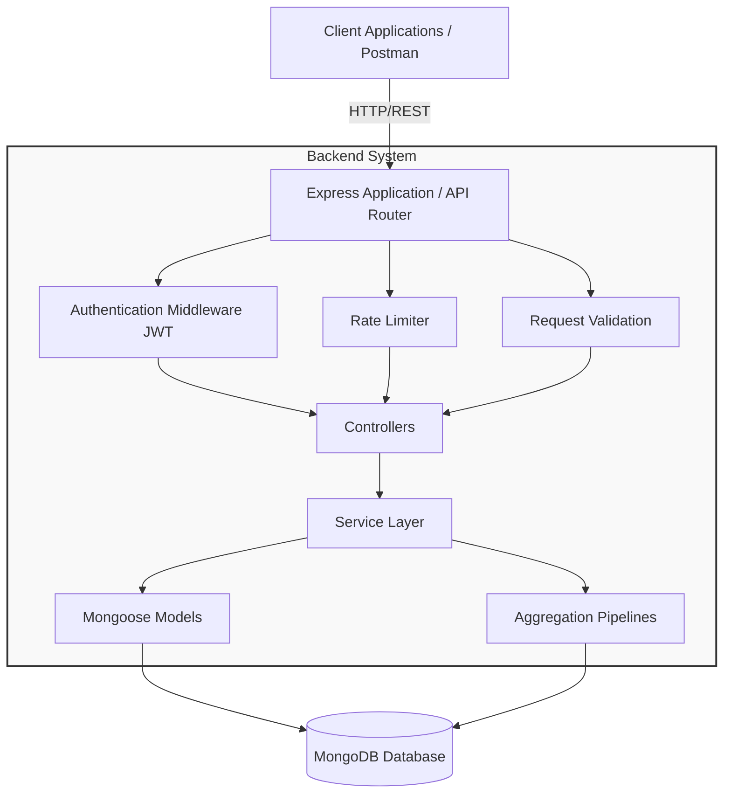
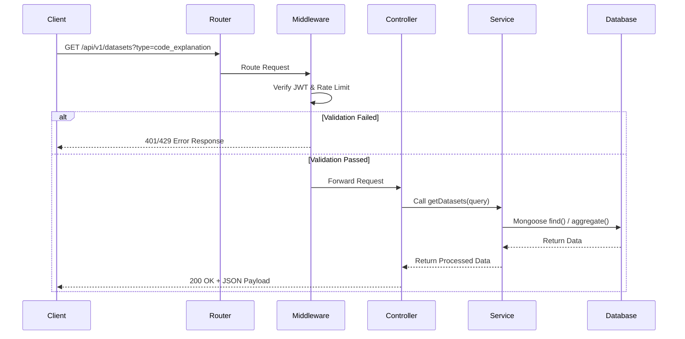

<h1 align="center">🚀 GitHub Dataset API System</h1>

<p align="center">
  <a href="https://nodejs.org/"></a>
  <a href="https://expressjs.com/"></a>
  <a href="https://www.mongodb.com/"></a>
  <a href="https://jwt.io/"></a>
  <a href="https://documenter.getpostman.com/view/50839285/2sBXwqqA6K"></a>
</p>
<p align="center">
  An enterprise-grade, scalable RESTful API system designed to manage, analyze, and serve extensive GitHub repository datasets.
</p>

<p align="center">
  🌐 <strong>Live Backend URL:</strong> <a href="https://github-dataset-chirag-prajapat.onrender.com" target="_blank">https://github-dataset-chirag-prajapat.onrender.com</a>
</p>

---

## 📖 Project Overview

The **GitHub Dataset API System** is a robust, backend-focused solution built to handle large-scale dataset operations. It provides a comprehensive suite of RESTful endpoints to store, query, filter, and analyze GitHub repository data formatted in JSON. Built with Node.js, Express.js, and MongoDB, this architecture prioritizes scalability, security, and performance, employing the MVC (Model-View-Controller) design pattern and an abstracted Service Layer.

## 🎯 Problem Statement

Machine learning researchers, data scientists, and software analysts often struggle with managing and extracting meaningful insights from massive, unstructured code datasets. Raw GitHub data dumps are difficult to query, lack standardized access methods, and are computationally expensive to process in-memory. There is a critical need for a centralized, high-performance API system that can ingest this data and provide complex querying capabilities (search, filter, aggregate) while ensuring secure and controlled access.

## 💡 Project Objectives

- **Scalable Data Ingestion**: Develop mechanisms to securely import and manage large JSON datasets containing GitHub repository metadata and code elements.
- **Advanced Querying**: Implement highly optimized APIs for full-text search, multi-parameter filtering, sorting, and cursor/offset-based pagination.
- **Data Analytics**: Utilize MongoDB Aggregation Pipelines to expose real-time statistics and insights about the dataset.
- **Robust Security**: Enforce strict access control using JWT-based authentication, role-based authorization, and comprehensive rate limiting.
- **Enterprise Architecture**: Maintain a clean, modular codebase using MVC and Service Layer patterns for maintainability and testability.

## 📊 Dataset Structure

The system processes GitHub repository data structured as JSON records. Each record represents a specific code element or instruction pair.

```json
{
  "id": "uuid-v4-string",
  "instruction": "Explain the purpose of the express.json() middleware.",
  "input": "app.use(express.json());",
  "output": "It parses incoming requests with JSON payloads...",
  "metadata": {
    "type": "code_explanation",
    "code_element": "middleware",
    "repo_name": "expressjs/express",
    "file_path": "lib/express.js",
    "source_type": "javascript",
    "doc_type": "source_code",
    "is_readme": false
  }
}
```

## 🏗️ System Architecture Diagram



## 🔄 Request Flow Diagram



## 🗄️ MongoDB Schema Design

The Mongoose schema is designed with indexing in mind to optimize read-heavy operations.

```javascript
const mongoose = require('mongoose');

const DatasetSchema = new mongoose.Schema({
  recordId: { type: String, required: true, unique: true, index: true },
  instruction: { type: String, required: true },
  input: { type: String, default: "" },
  output: { type: String, required: true },
  metadata: {
    type: { type: String, required: true, index: true },
    code_element: { type: String },
    repo_name: { type: String, index: true },
    file_path: { type: String },
    source_type: { type: String, index: true },
    doc_type: { type: String },
    is_readme: { type: Boolean, default: false }
  },
  createdBy: { type: mongoose.Schema.Types.ObjectId, ref: 'User' }
}, { 
  timestamps: true 
});

// Text index for full-text search capabilities
DatasetSchema.index({ instruction: 'text', output: 'text', 'metadata.repo_name': 'text' });

module.exports = mongoose.model('Dataset', DatasetSchema);
```

## 📂 Folder Structure

The project is split into a modular backend service and a modern React frontend dashboard:

```text
github_dataset_chirag_prajapat/
├── backend/             # Node.js + Express API Backend
│   ├── src/
│   │   ├── config/      # DB Connection configs
│   │   ├── controllers/ # Controllers (Req/Res logic)
│   │   ├── middlewares/ # Auth & Rate limiters
│   │   ├── models/      # Mongoose models
│   │   ├── routes/      # Routers (including OPTIONS preflights)
│   │   ├── services/    # Business logic layer
│   │   ├── scripts/     # Auto-import & CLI verification scripts
│   │   ├── utils/       # Mappings & apiFeatures
│   │   └── validations/ # Joi Schemas
│   ├── server.js        # Backend Server start script
│   └── package.json
│
├── frontend/            # React + Vite + Tailwind Client
│   ├── src/
│   │   ├── components/  # Layouts, guards, SEO utilities
│   │   ├── pages/       # Login, Register, Catalog, Charts, Profile
│   │   ├── services/    # Axios client with interceptors
│   │   └── store/       # Redux Toolkit State Store
│   ├── index.html       # HTML entry layout
│   └── package.json
└── README.md
```

## 🛠️ Technology Stack

| Category | Technology |
| :--- | :--- |
| **Backend Runtime** | Node.js |
| **Web Framework** | Express.js |
| **Database** | MongoDB + Mongoose |
| **Frontend Framework** | Vite + React 18 |
| **State Management** | Redux Toolkit |
| **Styling & Icons** | Tailwind CSS + Material UI + Lucide Icons |
| **Forms & Validation** | Formik + Yup |
| **Data Visualization** | Recharts |
| **API Communications** | Axios |
| **Security & Auth** | JSON Web Tokens (JWT) + bcrypt |

## 📦 API Modules

1. **Auth Module**: Handles user registration, login, token generation, and password management.
2. **Dataset Module**: Core CRUD operations for individual dataset records.
3. **Analytics Module**: Complex data aggregation, statistical analysis, and reporting APIs.
4. **Bulk Operations Module**: Dedicated endpoints for batch inserting or updating records.

## 🔐 Authentication Flow

1. **Registration**: User submits credentials -> Server hashes password (bcrypt) -> Saves to DB.
2. **Login**: User submits credentials -> Server verifies hash -> Generates JWT containing user ID and Role -> Returns token.
3. **Protected Routes**: Client sends JWT in `Authorization: Bearer <token>` header -> Auth Middleware verifies token signature and expiry -> Grants or denies access.

## 🔍 Search, Filter, Sort and Pagination Features

The dataset endpoint (`GET /api/v1/datasets`) supports advanced querying:

- **Pagination**: `?page=2&limit=50` (Defaults to page 1, limit 20).
- **Sorting**: `?sort=-createdAt` (Descending) or `?sort=metadata.repo_name` (Ascending).
- **Filtering**: `?metadata.type=code_explanation&metadata.is_readme=true`.
- **Search**: `?search=express%20middleware` (Utilizes MongoDB Text Search on indexed fields).

*Example Request:*
`GET /api/v1/datasets?metadata.source_type=python&sort=-createdAt&page=1&limit=10`

## 📈 Analytics & Aggregation Features

Leveraging MongoDB's Aggregation Framework, the system provides real-time insights:

- **Repository Distribution**: Count of records per `repo_name`.
- **Source Type Analysis**: Grouping records by programming language (`source_type`).
- **Data Volume Stats**: Total records, average text lengths, etc.

*Sample Aggregation Pipeline:*
```javascript
// Get count of records per source type
const stats = await Dataset.aggregate([
  { $group: { _id: "$metadata.source_type", count: { $sum: 1 } } },
  { $sort: { count: -1 } }
]);
```

## 🛡️ Security Features

- **JWT Authentication**: Stateless and secure user sessions.
- **Role-Based Access Control (RBAC)**: Distinguishes between `Admin` (can upload/delete data) and `User` (read-only).
- **Rate Limiting**: Prevents brute-force and DDoS attacks (e.g., max 100 requests per 15 minutes per IP).
- **Data Sanitization**: Prevents NoSQL injection using libraries like `express-mongo-sanitize`.
- **Security Headers**: Managed via `Helmet.js`.

## 🚨 Error Handling Strategy

Implemented a global, centralized error-handling middleware.

- Custom `AppError` class for operational errors.
- Standardized JSON error response format.
- Catching Unhandled Rejections and Uncaught Exceptions.

*Sample Error Response:*
```json
{
  "status": "fail",
  "error": {
    "code": 404,
    "message": "Dataset record not found with ID: 12345"
  }
}
```

## ⚡ Performance Optimization Strategy

- **Database Indexing**: Compound and text indexes applied to frequently queried fields.
- **Pagination Strategy**: Limits payload size and database query execution time.
- **Select Specific Fields**: Query projection to return only necessary fields (`?fields=instruction,metadata`).
- **Lean Queries**: Using Mongoose `.lean()` for faster read-only queries.

## 🌐 API Endpoint Categories

### Authentication
- `POST /api/v1/auth/register` - Register a new user
- `POST /api/v1/auth/login` - Authenticate and receive JWT

### Dataset Operations
- `GET /api/v1/datasets` - Get all datasets (supports query params)
- `GET /api/v1/datasets/:id` - Get specific dataset by ID
- `POST /api/v1/datasets` - Create a new dataset record (Admin)
- `PUT /api/v1/datasets/:id` - Update a dataset record (Admin)
- `DELETE /api/v1/datasets/:id` - Delete a dataset record (Admin)

### Bulk & Analytics
- `POST /api/v1/datasets/bulk-import` - Upload large JSON dataset array
- `GET /api/v1/datasets/stats/repository-distribution` - Get repo stats
- `GET /api/v1/datasets/stats/language-metrics` - Get source type stats

## 📅 Development Roadmap (15-Day Backend Plan)

| Phase | Days | Focus Area | Tasks |
| :--- | :--- | :--- | :--- |
| **Phase 1** | 1-3 | Setup & Architecture | Project init, Git setup, Folder structure, DB Connection, Error Handling setup. |
| **Phase 2** | 4-6 | Auth & Security | User Model, JWT Logic, Auth Middleware, Role Authorization. |
| **Phase 3** | 7-9 | Core API & DB Models | Dataset Schema, CRUD Controllers, Service layer integration. |
| **Phase 4** | 10-12 | Advanced Features | Pagination, Sorting, Multi-field Filtering, Text Search implementation. |
| **Phase 5** | 13-14 | Analytics & Scripts | Aggregation pipelines, Data import scripts, Data validation. |
| **Phase 6** | 15 | Polish & Documentation | Postman Docs, README refinement, Code Review, Performance Testing. |

## 🚀 Future Enhancements

- **Caching Layer**: Implement Redis to cache frequent analytical queries and pagination results.
- **GraphQL Integration**: Provide a GraphQL endpoint for more flexible client-side data querying.
- **Automated Testing**: Comprehensive unit and integration testing using Jest and Supertest.
- **Dockerization**: Create Dockerfiles and `docker-compose.yml` for seamless deployment.

## 📮 Postman Testing

A complete Postman collection is provided for testing the APIs.
1. Import the `GitHub_Dataset_API_Collection.json` file into Postman.
2. Set up the Environment Variables in Postman (`baseUrl`, `jwt_token`).
3. Run the Authentication endpoints first to populate the `jwt_token` variable automatically.

## 💻 Installation Guide

**Prerequisites:**
- Node.js (v16.x or higher)
- MongoDB (Local or Atlas)
- Git

```bash
# 1. Clone the repository
git clone https://github.com/Chiragprajapat003/github_dataset_chirag_prajapat.git

# 2. Navigate into the directory
cd github_dataset_chirag_prajapat

# 3. Install dependencies
npm install
```

## 🔑 Environment Variables

Create a `.env` file in the root directory and add the following:

```env
NODE_ENV=development
PORT=5000
MONGODB_URI=mongodb+srv://<username>:<password>@cluster.mongodb.net/github-dataset?retryWrites=true&w=majority
JWT_SECRET=your_super_secret_jwt_key_here
JWT_EXPIRES_IN=30d
```

## ▶️ Running the Project

```bash
# Run in development mode (with Nodemon)
npm run dev

# Run in production mode
npm start

# Run dataset import script (Make sure to place dataset.json in the data/ folder)
npm run data:import
```

## 📚 API Documentation

Detailed interactive API documentation is published and accessible live on Postman:

<p align="left">
  <a href="https://documenter.getpostman.com/view/50839285/2sBXwqqA6K" target="_blank">
    
  </a>
</p>

👉 **[Live Postman API Documentation](https://documenter.getpostman.com/view/50839285/2sBXwqqA6K)**

👉 **[Live Backend API URL](https://github-dataset-chirag-prajapat.onrender.com)**

Our interactive documentation contains detailed endpoint descriptions, query parameters, expected request payloads, and example responses for all categories.


---

## 👨‍💻 Author Information

Developed by **Chirag Prajapat**

- GitHub: [@Chiragprajapat003](https://github.com/Chiragprajapat003)

---
<p align="center">
  <i>Built with passion for clean code and robust architecture.</i>
</p>